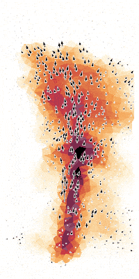

# Finite Element Networks

This project provides a clean and extensible reference implementation of Finite Element Networks as proposed in our paper

*[Learning the Dynamics of Physical Systems from Sparse Observations with Finite Element
Networks](https://openreview.net/forum?id=HFmAukZ-k-2)*  
Marten Lienen & Stephan Günnemann  
Published at ICLR 2022

<p align="center"><br />A learned flow field</p>

## Installation

First, install [pytorch](https://pytorch.org/get-started/locally/) and
[torch-scatter](https://github.com/rusty1s/pytorch_scatter#installation) according to your
CPU/GPU setup. Then you can clone the repository and install the package locally.

```
# Clone the repository
git clone https://github.com/martenlienen/finite-element-networks

# Change into the repository
cd finite-element-networks

# Make sure that a recent version of pip is available that supports PEP 518 projects
# with a pyproject.toml
pip install --upgrade pip

# Install the code as a local package
pip install --editable .
```

After this you can `import finite_element_networks` in your own code, python shell, and
notebooks, and easily integrate it into your existing code.

If you want to run our [example training script](examples/train.py), explore the
[notebooks](notebooks) or use our [pytorch lightning data
modules](finite_element_networks/lightning/data), you have to install the package with the
`lightning` extra.

```
pip install --editable '.[lightning]'
```

If you are a [weights & biases](https://wandb.ai) user, there is some [additional
code](finite_element_networks/lightning/wandb.py) to log plots and animations there during
training.

## Extending & Exploring

To get you started quickly, we have published a preprocessed version of the Black Sea and
ScalarFlow datasets as well as pre-trained checkpoints of both FEN and T-FEN. To get them,
run the following commands in the root of the repository.

```
curl -o data.zip https://zenodo.org/record/6366269/files/fen.zip
unzip data.zip
```

Now you can train a new model with `examples/train.py black-sea` or `examples/train.py
scalar-flow`. Note, that you can also train models or use the project in any other way
without downloading the data and checkpoints. However, if you use the data modules without
having downloaded the preprocessed datasets, the will download and prepare the data for
you, which is almost 500G for ScalarFlow and 13G for Black Sea.

If you end up using these datasets in your own work, please note that the raw data of both
datasets comes with their own license as we have described in the appendix of our paper.

Additionally, we provide some notebooks for you to recreate results and figures similar to
what we present in the paper.
- [forecasting_evaluation.ipynb](notebooks/forecasting_evaluation.ipynb) loads one of the
  checkpoints and computes the MAE over the test set
- [flow_fields_and_disentanglement.ipynb](notebooks/flow_fields_and_disentanglement.ipynb)
  renders animated versions of the inferred flow field and the disentanglement between
  free-form and transport term

The simplest way for you to apply this model to your own data will be to create your own
data module, which you can model directly after the ones that [we
provide](finite_element_networks/lightning/data).

## Cite

If you build upon this work, please cite our paper as follows.

```
@inproceedings{lienen_fen2022,
  title = {Learning the Dynamics of Physical Systems from Sparse Observations with Finite Element Networks},
  author = {Lienen, Marten and G\"unnemann, Stephan},
  booktitle={International Conference on Learning Representations (ICLR)},
  year = {2022},
}
```
